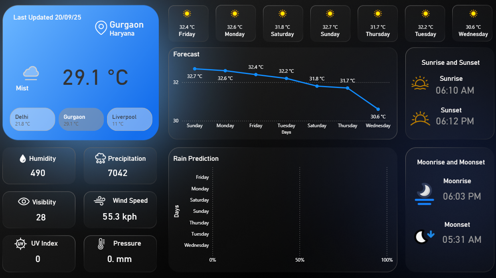

# 🌦 Weather Analytics Dashboard (Power BI)

**Author:** Suyash Joshi

This project presents the development and deployment of a **Weather
Analytics Dashboard** created using **Microsoft Power BI**.\
The dashboard fetches **live weather data from APIs** and translates it
into a **structured, interactive, and visually appealing** format for
enhanced decision-making.

It is a comprehensive project that combines **data extraction,
transformation, modeling, and visualization** in a single platform.

------------------------------------------------------------------------

## 📊 Dashboard Overview

The dashboard provides real-time weather analytics in a **simple,
intuitive, and dark-themed interface**. It consolidates multiple weather
indicators into a single view.

### 🔑 Primary Features:

-   🌡 **Current Temperature:** Real-time measurement in °C (option for
    °F conversion).\
-   📈 **Forecast Trends:** Line graph of day-wise maximum temperature
    (weekly).\
-   🌧 **Rain Prediction:** Probability charts for travel, agriculture,
    and events.\
-   🌅 **Sunrise & Sunset:** Displayed with icons and AM/PM formatting.\
-   🌙 **Moonrise & Moonset:** Useful for astronomy and event planning.\
-   📋 **Additional Metrics:** Humidity, Precipitation, Visibility, Wind
    Speed, UV Index, Pressure.

### 🎨 Design Considerations:

-   Dark theme for readability and contrast.\
-   Logical grouping: **Left panel (current conditions), Center
    (forecast), Right panel (solar/lunar details)**.\
-   Weather icons & conditional formatting for **better accessibility**.

------------------------------------------------------------------------

## ⚙️ Data Engineering

The backbone of this dashboard lies in **API integration and
transformation of JSON data** into structured datasets.

### Steps:

1.  **API Connection**
    -   Connected via **Power BI Web Data Connector**.\
    -   Enabled scheduled refresh for real-time updates.
2.  **Power Query (M Language)**
    -   Cleaned and reshaped JSON.\
    -   Removed nulls/duplicates.\
    -   Parsed nested forecast arrays & timestamps.
3.  **Date-Time Formatting**
    -   Converted **UTC → IST** with AM/PM formatting.
4.  **DAX Measures**
    -   Custom fields for:
        -   °C/°F conversion\
        -   Daily averages & rolling trends\
        -   Aggregated precipitation & humidity\
        -   Day-level forecast grouping

✅ Ensures **data accuracy + optimized refresh performance**.

------------------------------------------------------------------------

## 📈 Data Visualization

Power BI's visuals were leveraged for **clarity + interactivity**.

-   🟥 **Cards:** Display KPIs (Temp, Humidity, Wind, UV Index).\
-   📊 **Line Chart:** Weekly temperature trends (highs/lows).\
-   📉 **Bar Chart:** Rain prediction by day.\
-   🎯 **Icons:** Weather & astronomy visuals (sun, moon, mist).\
-   🎨 **Conditional Formatting:** Quick identification of extreme
    values.\
-   🖱 **Tooltips:** Added for hover-based exploration.

------------------------------------------------------------------------

## 🚀 Key Features

-   🔄 Real-time **API Integration** with scheduled refresh.\
-   📐 **Custom DAX** measures for advanced weather insights.\
-   🎨 Dark theme with drill-throughs & city-wise filters.\
-   🌍 Scalable to support multiple cities & regions.

------------------------------------------------------------------------

## 💡 Insights

The dashboard enables **decision-making** in multiple domains:

-   ✈️ **Travel & Events:** Plan safer outdoor activities with rain/UV
    data.\
-   🔮 **Forecast Awareness:** Weekly temperature fluctuations for
    better preparedness.\
-   🚢 **Aviation & Marine:** Visibility and wind speed support safety.\
-   🌾 **Agriculture:** Sunrise, sunset & precipitation data aid
    irrigation planning.\
-   🏥 **Public Health:** UV alerts help reduce heatwave-related risks.

------------------------------------------------------------------------

## 🔮 Future Improvements

-   🗺 **Geospatial Mapping:** Use Power BI Maps for regional weather
    comparisons.\
-   🤖 **AI/ML Forecasting:** Predict severe weather using Python/R
    integration.\
-   📱 **Mobile Responsiveness:** Optimize for tablets & smartphones.\
-   ⚠️ **Custom Alerts:** Real-time warnings (rainfall, storms,
    heatwaves).\
-   📜 **Historical Trends:** Incorporate past climate data for
    long-term analysis.

------------------------------------------------------------------------

## 📚 References

-   [Microsoft Power BI Docs](https://learn.microsoft.com/power-bi/)\
-   [OpenWeather API](https://openweathermap.org/)\
-   [DAX Language Reference](https://learn.microsoft.com/dax/)\
-   [Power Query (M Language)](https://learn.microsoft.com/power-query/)

------------------------------------------------------------------------

## ✅ Conclusion

The **Weather Analytics Dashboard** demonstrates how **real-time APIs**
can be integrated into **business intelligence tools** like Power BI.\
By leveraging **Power Query, DAX, and visualization best practices**, it
ensures **accuracy, clarity, and usability**.

With future scalability and AI integration, this project lays the
foundation for **advanced weather analytics** across industries such as
**aviation, agriculture, event management, and public safety**.
